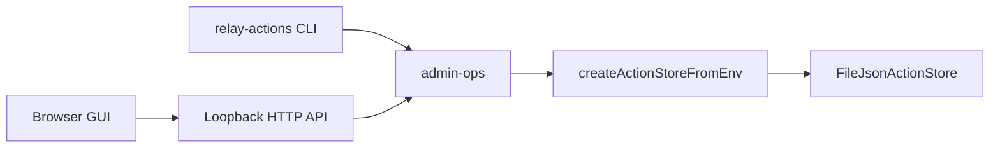

# Action Store Admin GUI (+ CLI)

## Context

HITL edits today only happen mid-run via the feedback broker. Persistence exists in [`packages/action-store`](packages/action-store) (`list` / `get` / `put` / `updateStatus` / `delete`). Operators need an offline browse/edit surface.

**Primary deliverable:** local admin GUI. **Secondary:** CLI that shares the same ops.

## Approach

1. **`admin-ops.ts`** — shared helpers over `ActionStore`: list, get, edit field, status transition, delete.
2. **`admin-server.ts`** — Node `http` server (no new deps), bind `127.0.0.1` only; serve static SPA + JSON API.
3. **`cli.ts`** — thin argv wrapper over the same ops.
4. **Static UI** — single HTML/CSS/JS page (vanilla): filterable list, detail pane with editable `draftText` and other payload fields, status dropdown, delete.

## Edit rules

- **Lifecycle-safe draft text:** `pending_approval` + field `draftText` → `updateStatus(id, "edited", { payload: { draftText, status: "edited" } })`.
- **Admin patch (other fields / other statuses):** `get` → shallow-merge into `payload` → `put` with bumped `updatedAt`.
- Reject rewriting `id` / `appId` / `createdAt`.

## HTTP API (loopback)

| Method | Path | Behavior |
|--------|------|----------|
| `GET` | `/api/actions?status=&appId=&limit=` | `store.list` |
| `GET` | `/api/actions/:id` | `store.get` |
| `PATCH` | `/api/actions/:id` | body `{ field, value }` → edit rules |
| `POST` | `/api/actions/:id/status` | body `{ status }` → `updateStatus` |
| `DELETE` | `/api/actions/:id` | `store.delete` |
| `GET` | `/` | admin SPA |

Env: `ACTION_STORE_ADMIN_PORT` (default `8787`), `ACTION_STORE` / `ACTION_STORE_PATH` via existing factory.

## Package wiring

[`packages/action-store/package.json`](packages/action-store/package.json):

- `"bin": { "relay-actions": "./dist/cli.js" }`
- scripts: `"admin": "node dist/admin-server.js"`, `"actions": "node dist/cli.js"`
- Copy or embed static assets so `dist` can serve them after `tsc` (prefer `public/` copied via a small postbuild, or inline HTML string in the server to avoid copy complexity)

**Default for assets:** embed the SPA as a template string / read from `../public` relative to package root with a fallback path so no extra build step is required if we serve from `packages/action-store/public` at runtime via `import.meta`/`__dirname` resolution from `dist/`.

## Docs

Short section in [`apps/community-engager/README.md`](apps/community-engager/README.md): start admin (`pnpm --filter @relay/action-store admin`), open `http://127.0.0.1:8787`, set `ACTION_STORE_PATH` for deploy data. Mention CLI as secondary.

## Out of scope

- Auth beyond loopback bind
- Postgres driver
- `patchPayload` store API
- Full React/Vite app
