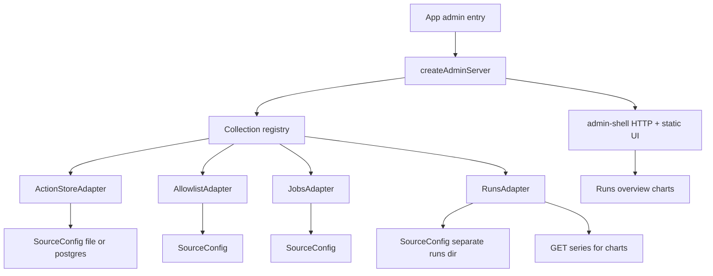

# Abstract admin shell + per-source locations + runs charts

## Goal

Decouple today’s community-engager-shaped admin ([`packages/action-store/public`](packages/action-store/public), [`admin-server.ts`](packages/action-store/src/admin-server.ts), [`admin-collections.ts`](packages/action-store/src/admin-collections.ts)) into:

1. A **generic shell** any app can boot
2. **Per-collection adapters** owned by the app (or shared packages)
3. **Independent source config** per collection (runs can live outside `.data/`; Postgres later without rewriting the UI)

## Architecture



### Package layout

| Package / path | Responsibility |
|----------------|----------------|
| New [`packages/admin-shell`](packages/admin-shell) | `createAdminServer`, generic `/api/collections/*` router, static SPA, chart widgets |
| [`packages/action-store`](packages/action-store) | Keep store port + `admin-ops` + CLI; **remove** community allowlist/jobs/runs + embedded SPA |
| [`apps/community-engager`](apps/community-engager) | `src/admin.ts` entry: load env, build sources, register adapters, call `createAdminServer` |

`admin:store` on community-engager points at `dist/admin.js` (not action-store’s server).

## Collection adapter contract

Define in `@relay/admin-shell` (TypeScript):

```ts
type SourceConfig =
  | { driver: "file"; path: string }           // file or directory
  | { driver: "postgres"; connectionString: string; table?: string };

interface CollectionAdapter {
  id: string;           // "actions" | "allowlist" | ...
  label: string;
  source: SourceConfig; // echoed in /api/meta for operators
  capabilities: {
    list: true;
    get: true;
    patch?: boolean;
    delete?: boolean;
    actions?: string[]; // e.g. ["promote","reject","status"]
    series?: boolean;   // chronological metrics for charts
  };
  list(filter): Promise<{ rows; columns }>;
  get(id): Promise<{ record; detail }>;
  patch?(id, body): Promise<{ record }>;
  delete?(id): Promise<{ deleted }>;
  action?(name, id, body): Promise<{ record }>;
  series?(query): Promise<SeriesPayload>; // only when capabilities.series
}
```

**HTTP (generic, not per-domain):**

- `GET /api/meta` — app name, collections + capabilities + resolved `source` (paths redacted only if we ever add secrets; file paths OK on loopback)
- `GET /api/collections/:id` — list
- `GET|PATCH|DELETE /api/collections/:id/items/:itemId`
- `POST /api/collections/:id/items/:itemId/actions/:action`
- `GET /api/collections/:id/series?from=&to=&limit=` — chart data

UI becomes **capability-driven**: nav from registry; detail forms from `detail` hints + raw JSON fallback; action buttons from `capabilities.actions`. Domain-specific promote/reject/draftText editors stay as **detail kind** hints (`kind: "action-draft" | "allowlist-entry" | "json"`) so the shell does not import community types.

## Independent locations (file now, Postgres later)

**Rule:** never assume one `dataDir` for all collections. Each adapter receives its own `SourceConfig` at construction.

Community-engager wiring (explicit env, already partially present):

| Collection | File source resolution |
|------------|------------------------|
| Actions | `ACTION_STORE_PATH` (existing) → `{ driver: "file", path }` |
| Allowlist | `ALLOWLIST_PATH` or default `{REDDIT_DATA_DIR\|.data}/allowlist/subreddits.json` |
| Jobs | `JOBS_DIR` or default `{dataRoot}/jobs` |
| Runs | `COMMUNITY_RUNS_DIR` (existing in [`run-log.ts`](apps/community-engager/src/run-log.js)) or default `{dataRoot}/runs` — **may differ from dataRoot** |

Document new optional env keys in [`.env.example`](apps/community-engager/.env.example). Resolve relatives against the loaded `.env` directory (same pattern as [`load-env.ts`](packages/action-store/src/load-env.ts)); move that helper into admin-shell or a tiny shared util.

**Postgres later (shape only in this work):**

- `SourceConfig.driver: "postgres"` is part of the type union now
- File adapters throw a clear error if given `postgres`
- ActionStore already has a reserved postgres factory in [`factory.ts`](packages/action-store/src/factory.ts) — future `ActionStoreAdapter` swaps `createActionStoreFromEnv` without UI changes
- Runs/allowlist/jobs get Postgres implementations behind the same adapter interface when needed; no shared “one database” assumption — each collection can point at its own table/DSN

Do **not** implement Postgres drivers in this plan.

## Runs charts

Runs are chronological logs ([`RunLogRecord`](apps/community-engager/src/run-log.ts): `startedAt`, `endedAt`, `durationMs`, `summary.scouted|approved|aborted|failed|jobs`).

**Runs adapter `series()`** returns a stable payload:

```ts
{
  points: Array<{
    t: string;          // endedAt
    runId: string;
    durationMs: number;
    scouted: number;
    approved: number;
    aborted: number;
    failed: number;
    jobs: number;
    runState?: string;
  }>;
}
```

**GUI (Runs collection) — v1 (done):**

- Keep list + detail (raw JSON)
- **Overview** strip when `capabilities.series` is true:
  - Line: `durationMs` over time
  - Stacked bars: `approved` / `aborted` / `failed` per run
- Inline SVG; click point → select run. Filters: `limit` / `from` / `to` on series.

## Runs debug charts (next)

Upgrade the Runs overview for **investigation**, not only a health pulse. Prefer a small fixed set:

| Chart | Question it answers | Data |
|-------|---------------------|------|
| **Timeline / Gantt** (one lane per run, optional stage segments) | Where did wall-clock go? hung scout/HITL? | `startedAt`, `endedAt`, `durationMs`; stage evidence from `summary` when present (`session`, `discover`, `scout`, jobs) |
| **Outcome stack** (keep/refine v1) | HITL quality / abort storms | `approved`, `aborted`, `failed` |
| **Duration × outcome scatter** | Slow failures vs quick empty runs | `durationMs` vs `runState` / abort-heavy |
| **Scout funnel** (secondary) | Empty scout vs draft/HITL drop-off | `scouted` → jobs queued → approved/posted |
| **Per-sub / blocked** (drill-down, later) | Interstitial / sub-specific walls | `summary.scout` |

**UX rules:**

- Default view: **timeline + outcome stack**; scatter and funnel as toggles or a second row.
- Click any mark → open that run in the detail pane (existing list selection).
- Deprioritize duration-only lines without outcome context for debug mode.
- Stay **inline SVG** in admin-shell unless complexity forces a tiny helper; no heavy chart library.
- Extend `series()` (or add `series?view=debug`) so stage/funnel fields are available without N+1 GETs of full run JSON.

## Migration steps

1. ~~Create `@relay/admin-shell`…~~
2. ~~ActionStore collection adapter…~~
3. ~~CE adapters with per-source paths…~~
4. ~~`admin.ts` entry + strip community SPA from action-store…~~
5. ~~Wire Runs `series` + SVG overview charts…~~
6. ~~Docs for multi-path env…~~
7. ~~**Implement debug chart suite** (timeline, scatter, funnel) on Runs tab.~~
8. **Per-run investigation** — list is the picker; `GET` returns `detail.kind: "run-debug"` + `viz` (stages, jobs, scout, funnel); aggregate series charts behind optional **Compare runs**.

## Out of scope

- OpenUI / generative UI
- Implementing Postgres drivers
- Auth beyond loopback bind
- Generic arbitrary-JSON file browser as a first-class collection
- Dense multi-KPI executive dashboards