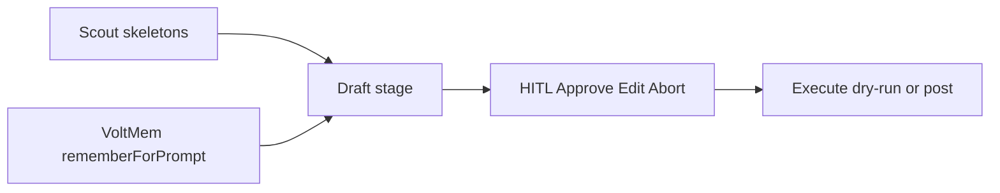

# Draft proposed posts (CommunityEngager)

## Current gap

Pipeline already has `draft` → HITL → execute. What is missing is **real reply text**:

- Scout builds skeletons with `status: "proposed"` and empty `draftText` in [`map-drafts.ts`](apps/community-engager/src/reddit/map-drafts.ts) — OP `selftext` is scored then **dropped**.
- [`drafter.ts`](apps/community-engager/src/drafter.ts) emits a fixed template from title only (live runs have no fixture `opText`).
- [`createLlmDraftEngine()`](apps/community-engager/src/engines.ts) calls that stub; comment says “until a real LLM provider is wired”.
- Monorepo already has Gemini via [`@relay/llm-controller`](packages/llm-controller/src/provider.ts) (`GEMINI_API_KEY`, `@google/genai`).

## Approach (v1)

**Default provider:** Gemini (`gemini-2.5-flash`) via `@google/genai`, same stack as llm-controller. No new LLM package. Stub remains fallback when `GEMINI_API_KEY` is unset (fixtures / offline CI).

**Scope:** Reddit **comment replies** only (not new top-level posts). Intensity 0–1 from the model with prompt constraints; intensity 2 still clamped / rare (existing HITL double-confirm stays).

## Implementation

### 1. Carry OP body on the draft

Add optional `opText?: string` to [`CommunityDraft`](apps/community-engager/src/types.ts).

In [`listingPostsToDrafts`](apps/community-engager/src/reddit/map-drafts.ts), set `opText: post.selftext` (trim / cap ~4k chars). Fixture path in [`fixtures/threads.ts`](apps/community-engager/src/fixtures/threads.ts) copies `opText` onto the skeleton so fixtures and live share one field.

Update stub `draftReply` to prefer `draft.opText` over fixture lookup.

### 2. LLM draft module

New small module e.g. [`apps/community-engager/src/draft-llm.ts`](apps/community-engager/src/draft-llm.ts):

- Input: `CommunityDraft` + `memoryBlock?`
- Prompt: help-first voice, answer the OP concretely, soft GoStylens mention only when intensity ≥ 1, never hard-sell, respect abort/spam hints from memory, output **JSON** `{ draftText, intensity, rationale? }`
- Call Gemini with JSON response schema (mirror pattern from `GeminiProvider`)
- Validate: non-empty `draftText`, intensity in `0|1` (clamp `2` → `1` for v1 unless disclosure already present)
- On API failure: log and fall back to stub

Wire from [`draftReply`](apps/community-engager/src/drafter.ts) (or engine only): if key present → LLM; else stub. Keep [`createLlmDraftEngine`](apps/community-engager/src/engines.ts) as the single entry so controller path unchanged.

### 3. Evidence + env

Extend [`DraftEvidence`](apps/community-engager/src/run-evidence.ts) with `provider: "gemini" | "stub"`, `draftChars`, optional short preview.

Document `GEMINI_API_KEY` in [`.env.example`](apps/community-engager/.env.example). README draft stage line: real LLM when key set.

### 4. Tests

- Unit: `opText` preserved in `listingPostsToDrafts`
- Unit: prompt builder includes title, opText, memory, intensity rules
- Unit: parse/clamp of model JSON; stub fallback when no key
- Existing e2e-hitl stays on stub (no key in CI)

## Non-goals (this slice)

- New top-level Reddit posts
- Swapping providers (OpenAI / Ollama) — add later behind the same `draftReply` interface
- Living-todo UI for drafts (separate shell plan)
- Changing HITL / execute / dry-run contracts

## Success criteria

- Live scout → draft shows thread-specific reply text in Telegram/CLI (not the wardrobe-roles template)
- Run JSON evidence shows `provider: "gemini"` when key set
- Without key, fixtures/e2e still pass via stub
- Abort/edit/approve path unchanged; dry-run still default