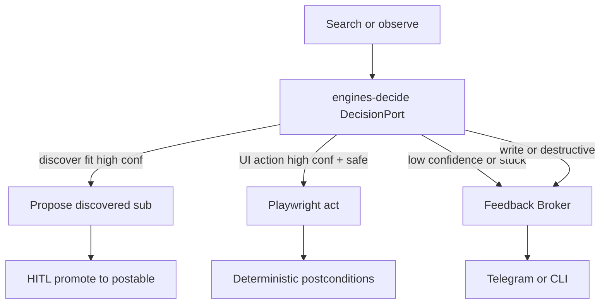

# Relay OS — Jev decide + Feedback Broker

Sibling of `[relay_reddit_browser.plan.md](./relay_reddit_browser.plan.md)` and Phase 6 in `[relay_hitl_community_voltmem.plan.md](./relay_hitl_community_voltmem.plan.md)`. Fulfills the “vision agent escape hatch” with a **typed decide layer** (TypeSafe Jev), not a free-form VLM driver.

## Thesis

```text
Observe / retrieve (Relay owns this)
        ↓
@relay/engines-decide (Jev Choice / Noul / Score)
        ↓
  act / propose (high confidence + safe)
  escalate (low confidence / stuck) → FeedbackRequest via broker
  irreversible write / allowlist promote → always HITL (ignore confidence)
```

Jev never browses, never invents selectors or sub names, never holds credentials, never auto-promotes. Relay owns observe / retrieve / act / verify; adapters stay app-agnostic.

## Architectural placement (committed)


| Layer                                                  | Role                                                                                    |
| ------------------------------------------------------ | --------------------------------------------------------------------------------------- |
| `[packages/protocol](packages/protocol)`               | Shared `Decision*` types + escalate → `FeedbackRequest` helper; **no new `EngineType`** |
| **New** `packages/engines-decide`                      | `DecisionPort` + `JevDecisionBackend` + `HeuristicDecisionBackend` (tests/offline)      |
| `[packages/engines-browser](packages/engines-browser)` | `observeCandidates` / page-text helpers; actuation unchanged                            |
| `[packages/feedback-broker](packages/feedback-broker)` | Present escalate as `choice` or `confirmation`                                          |
| `[apps/community-engager](apps/community-engager)`     | First consumer: **discover fit** (then interstitial / login / composer)                 |


**Why not `EngineType: "decide"`:** Decide is a co-processor, not a stage engine. Stages keep `engine: "browser" | "none" | …`. Apps inject `DecisionPort` the same way they inject `PlaywrightEngine` today (`[apps/community-engager/src/engines.ts](apps/community-engager/src/engines.ts)`).




## Protocol additions (`[packages/protocol/src](packages/protocol/src)`)

Add a small module (e.g. `decide.ts`), re-exported from package index:

- `DecisionCandidate { id, label, hint? }`
- `DecisionQuestion` — `choice` | `noul` | `score`
- `DecisionRequest { state, questions, policy? }`
- `DecisionAnswer` — typed result + `confidence` / probabilities
- `DecisionRoute` — `"act" | "escalate" | "abort"` (for discover: `"propose"` maps to act-side “add to proposed list”)
- `routeDecision(answer, policy) → DecisionRoute`
- `decisionToFeedbackRequest(...)` — escalate → existing `[FeedbackRequest](packages/protocol/src/feedback.ts)`

**Hard policy (code, not prompt):**

1. Any action marked `destructive` / `network_write` / comment-submit → always escalate.
2. CAPTCHA / “prove humanity” → escalate only; never auto-solve.
3. Allowlist **promote to postable** → always HITL (existing discover `choice`); Jev only gates **proposed**.
4. Confidence is a router; success still needs deterministic verify where applicable.

## Package: `@relay/engines-decide`

```text
packages/engines-decide/
  src/
    types.ts          # DecisionPort
    route.ts          # policy + thresholds
    escalate.ts       # Decision → FeedbackRequest
    backends/
      heuristic.ts    # keyword / fixture backend for unit tests
      jev.ts          # TypeSafe Jev HTTP client (Choice/Noul/Score)
    index.ts
  package.json        # depends on @relay/protocol
```

- Env: `JEV_API_KEY`, `JEV_BASE_URL`, `DECIDE_BACKEND=jev|heuristic`
- Per-task floors: `DECIDE_DISCOVER_MIN_CONFIDENCE` (calibrate from traces; start conservative), later interstitial/login floors
- `DecisionPort.decide(req): Promise<DecisionAnswer>`
- Unit tests: heuristic backend + `routeDecision` + escalate mapping (no live Jev in CI)

## Browser observe seam (`[packages/engines-browser](packages/engines-browser)`)

Needed for UI dogfood (Phases B–D), not for discover-fit Phase A:

- `observe` / candidates from a11y + short page text; actuation resolves **id → locator** in code.

## Dogfood path: CommunityEngager

### Phase A — discover fit (first) — preferred first ship

Phase 6 already shipped: Reddit search → heuristic score → HITL promote (`[discover-subs.ts](apps/community-engager/src/reddit/discover-subs.ts)`, `[discover.ts](apps/community-engager/src/discover.ts)`, allowlist store).

**Replace the middle heuristic fit gate with Jev:**

```text
subreddit search (unchanged)
  → for each candidate: state = app goal + bio/title/public_description
       (+ optional sample titles when mid-confidence)
  → Noul: "Fits our community goal?" (+ optional Noul: "Rules look OK for soft help / soft mention?")
  → confidence ≥ floor → upsertProposed (status=proposed only)
  → confidence mid → optional second look or skip
  → confidence low → drop (or rare escalate)
  → existing discover choice HITL → promote → postable (unchanged)
```

- Goal string: env/config (e.g. `COMMUNITY_DISCOVER_GOAL`) — fashion/styling help-first for GoStylens; soft mention; not hard spam.
- Keep hard vetoes in code where cheap (e.g. NSFW, non-public) so Jev never sees junk.
- **Never** auto-promote to postable on Jev confidence alone.

### Discover stage gating (committed)

Always-on discover is expensive (search + CAPTCHA risk + HITL pause). Prefer **smart skip**, with an explicit force path.


| Mode             | When discover runs                                                                                                                                                                                                                    |
| ---------------- | ------------------------------------------------------------------------------------------------------------------------------------------------------------------------------------------------------------------------------------- |
| `auto` (default) | Only if postable allowlist is **thin**: `postable.length < COMMUNITY_DISCOVER_MIN_POSTABLE` (default = seed size, e.g. 4). Once you have enough postable subs (seed + human-promoted), skip discover and go `ensure_session → scout`. |
| `force`          | Always run discover this run (research pass even when allowlist is healthy).                                                                                                                                                          |
| `off`            | Never run discover.                                                                                                                                                                                                                   |


**Force overrides (any one is enough):**

1. Env: `COMMUNITY_DISCOVER=force` (or `true` as alias of force for dogfood; prefer explicit `auto|force|off`).
2. Intent / trigger: manifest trigger e.g. `"discover subreddits"` / `"research new communities"` sets `context.forceDiscover = true` when the app is spawned from that intent (Intent Router later; for `run-dev`, env or CLI flag is enough).
3. Optional later: timer / “last discover older than N days” — not required for first ship.

**Skip implementation:** in `shouldSkipFeedbackPoint` + `runDiscover` no-op when gated off/auto-satisfied; do not emit discover `choice` if the stage did not research. Log clearly: `[discover] skipped — allowlist healthy (N postable ≥ min)`.

**Metric for “enough”:** count **postable** entries (seed + promoted), not raw `proposed`. A pile of unpromoted proposals should not block discover forever — if `proposed` backlog is large and postable is healthy, still skip (human can promote from store/UI later if we add that); if postable is thin, run discover even if proposals exist.

### Phase B — page class

Wrap `[detectInterstitial](apps/community-engager/src/reddit/interstitial.ts)`: Choice `feed | login | interstitial | rate_limit | unknown`; low confidence → broker escalate.

### Phase C — login / challenge routing

`[browser-login.ts](apps/community-engager/src/reddit/browser-login.ts)`: decide among observed controls; OTP/CAPTCHA still `credential` / `onChallenge`.

### Phase D — comment composer target

Choice over composer candidates; submit remains Approve-gated.

**Out of scope:** LLM draft quality, living-todo UI, Newsletter Migrator port (same `DecisionPort` later).

## Runtime / broker

- Discover escalate (rare) can reuse `choice` / `confirmation` on the discover stage.
- Interstitial escalate reuses scout confirmation.
- Mid-stage `EngineResult.feedback_required` only if a decide loop must pause inside `execute` without a declared feedback point.
- Adapters stay app-agnostic; `meta.kind` e.g. `discover` / `interstitial`.

## Docs / deploy

- `[ARCHITECTURE.md](ARCHITECTURE.md)`: Decide co-processor.
- Cross-link reddit browser “vision escape hatch” + HITL Phase 6 → this plan.
- ThinkPad: `JEV_API_KEY` only when `DECIDE_BACKEND=jev`; heuristic/off so overnight scout does not hard-fail.

## Non-goals

- Jev as primary listing extractor (scout fields stay structured extract).
- Jev inventing subreddit names (search proposes; Jev only scores fit).
- Auto-solving CAPTCHAs.
- Auto-promoting discovered subs to postable.
- Replacing Approve/Edit/Abort before post.
- Vendor lock in CommunityEngager — only `DecisionPort`.

## Success criteria

1. Heuristic backend + route/escalate unit tests green without network.
2. Live Jev behind env flag; **discover fit** path can call it and populate proposed allowlist only above calibrated confidence.
3. Human promote gate still required before scout drafts into a new sub.
4. Discover **auto-skips** when postable allowlist ≥ min; `force` / discover intent still runs research.
5. Low-confidence interstitial (Phase B) surfaces broker feedback with no adapter Reddit copy.
6. Comment submit and CAPTCHA never auto-proceed on confidence alone.
7. ARCHITECTURE + plan cross-links updated.

