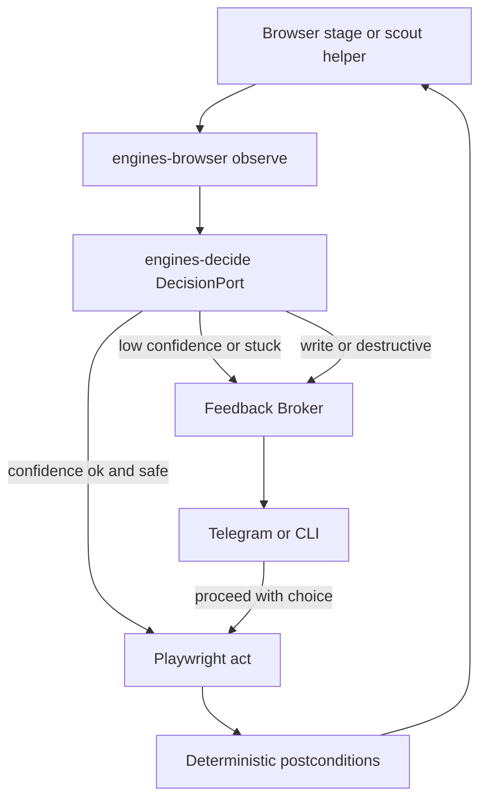

# Relay OS — Jev decide + Feedback Broker

Sibling of [`relay_reddit_browser.plan.md`](.cursor/plans/relay_reddit_browser.plan.md). Fulfills that plan’s “vision agent escape hatch” with a **typed decide layer** (TypeSafe Jev), not a free-form VLM driver.

## Thesis

```text
Playwright observe → candidates/text
        ↓
@relay/engines-decide (Jev Choice / Noul / Score)
        ↓
  act (high confidence + safe)     → Playwright click/type/scroll
  escalate (low confidence / stuck) → FeedbackRequest via broker
  irreversible write               → always HITL (ignore confidence)
```

Jev never browses, never invents selectors, never holds credentials. Relay owns observe / act / verify; adapters stay app-agnostic (`choice` / `confirmation` / `credential`).

## Architectural placement (committed)

| Layer | Role |
|-------|------|
| [`packages/protocol`](packages/protocol) | Shared `Decision*` types + escalate → `FeedbackRequest` helper; **no new `EngineType`** |
| **New** `packages/engines-decide` | `DecisionPort` + `JevDecisionBackend` + `HeuristicDecisionBackend` (tests/offline) |
| [`packages/engines-browser`](packages/engines-browser) | `observeCandidates` / page-text helpers; actuation unchanged |
| [`packages/feedback-broker`](packages/feedback-broker) | Present escalate as `choice` or `confirmation` (already supports both) |
| [`apps/community-engager`](apps/community-engager) | First consumer: replace regex-heavy interstitial classify with decide+escalate |

**Why not `EngineType: "decide"`:** Decide is a co-processor for browser (and later desktop) loops, not a stage engine. Stages keep `engine: "browser" | "none" | …`. Apps inject `DecisionPort` the same way they inject `PlaywrightEngine` today ([`apps/community-engager/src/engines.ts`](apps/community-engager/src/engines.ts)).



## Protocol additions ([`packages/protocol/src`](packages/protocol/src))

Add a small module (e.g. `decide.ts`), re-exported from package index:

- `DecisionCandidate { id, label, hint? }`
- `DecisionQuestion` — `choice` (criteria list) | `noul` (statement) | `score` (ordered levels)
- `DecisionRequest { state, questions, policy? }`
- `DecisionAnswer` — typed result + `confidence` / probabilities
- `DecisionRoute` — `"act" | "escalate" | "abort"`
- `routeDecision(answer, policy) → DecisionRoute` — confidence floor + hard rules
- `decisionToFeedbackRequest(...)` — maps escalate to existing [`FeedbackRequest`](packages/protocol/src/feedback.ts) (`type: "choice"` with candidate labels, or `confirmation`; put scores in `context.details` / `meta`)

**Hard policy (code, not prompt):**

1. Any action marked `destructive` / `network_write` / comment-submit → always escalate.
2. CAPTCHA / “prove humanity” → escalate only; never auto-solve (same rule as interstitial HITL today).
3. Confidence is a router; success still needs deterministic verify (URL/DOM postcondition).

## Package: `@relay/engines-decide`

```text
packages/engines-decide/
  src/
    types.ts          # DecisionPort
    route.ts          # policy + thresholds
    escalate.ts       # Decision → FeedbackRequest
    backends/
      heuristic.ts    # keyword / fixture backend for unit tests
      jev.ts          # TypeSafe Jev HTTP client (Choice/Noul/Score)
    index.ts
  package.json        # depends on @relay/protocol
```

- Env: `JEV_API_KEY`, `JEV_BASE_URL`, `DECIDE_BACKEND=jev|heuristic`, per-task floors later (`DECIDE_MIN_CONFIDENCE` default unset until calibrated — match Jev guidance).
- `DecisionPort.decide(req): Promise<DecisionAnswer>`
- Unit tests: heuristic backend + `routeDecision` + escalate mapping (no live Jev in CI).

## Browser observe seam ([`packages/engines-browser`](packages/engines-browser))

Extend beyond current `navigate|click|input|extract|snapshot` ([`types.ts`](packages/engines-browser/src/types.ts)):

- `observe` action (or helper on `PlaywrightEngine`): return compact **numbered candidates** from a11y/interactive nodes + short page text (title, h1, dialogs). Model never sees raw HTML dump as free text for actuation — only ids Relay built.
- Actuation still resolves **id → SemanticLocator / locator** in code after decide.

No Stagehand/Skyvern hard-wire; Jev replaces the “LLM guesses the control” path for navigation classification.

## Dogfood path: CommunityEngager

**Phase A — page class (first):** Replace / wrap [`detectInterstitial`](apps/community-engager/src/reddit/interstitial.ts) with a decide call:

- Questions: Choice among `feed | login | interstitial | rate_limit | unknown`; Noul “stuck / need human”.
- High confidence → keep current behavior (block sub / continue / escalate headed).
- Low confidence or `unknown` → `FeedbackRequest` `choice` with those labels (reuse scout confirmation path in [`controller.ts`](apps/community-engager/src/controller.ts) or a dedicated escalate).

**Phase B — login / challenge routing:** In [`browser-login.ts`](apps/community-engager/src/reddit/browser-login.ts), use decide to pick next control among observed candidates; OTP/CAPTCHA still `credential` / headed `onChallenge`.

**Phase C — comment composer target:** Before typing, Choice over composer candidates; submit click always escalates to existing Approve (no change to “nothing posts without Approve”).

**Out of scope for this plan:** LLM draft quality, Phase 6 discovery, living-todo UI, Newsletter Migrator port (same `DecisionPort` later).

## Runtime / broker

- Prefer returning escalate via existing controller + feedback points (scout confirmation already works). Mid-stage `EngineResult.feedback_required` is **not** required for Phase A; add only if a decide loop must pause inside `execute` without a declared feedback point.
- Adapters: no Reddit-specific strings; options/labels come from candidates; `meta.kind` only when needed (e.g. `interstitial`).

## Docs / deploy

- Short section in [`ARCHITECTURE.md`](ARCHITECTURE.md) under Execution Engines: Decide co-processor.
- Cross-link from reddit browser plan “vision escape hatch” → this plan.
- Deploy: ThinkPad needs `JEV_API_KEY` only when `DECIDE_BACKEND=jev`; default heuristic/off until keys present so overnight scout does not hard-fail.

## Non-goals

- Jev as primary scout metadata extractor (listings stay structured extract).
- Auto-solving CAPTCHAs.
- Replacing Approve/Edit/Abort before post.
- Recursive decide-inside-fanout children special-casing (children inherit the same injected port).
- Vendor lock in CommunityEngager — only talk to `DecisionPort`.

## Success criteria

1. Heuristic backend + route/escalate unit tests green without network.
2. Live Jev backend behind env flag; interstitial classify path can call it.
3. Low-confidence interstitial surfaces a broker `choice`/`confirmation` (Telegram/CLI) with no adapter Reddit copy.
4. Comment submit and CAPTCHA never auto-proceed on confidence alone.
5. ARCHITECTURE + plan cross-links updated.
