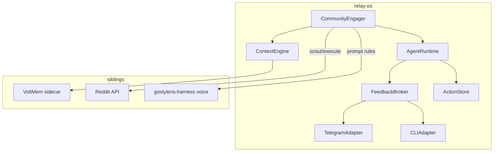
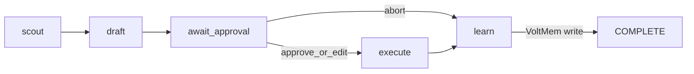

# Relay OS — HITL runtime + CommunityEngager + VoltMem

Canonical plan for this repo. Open while the `relay-os` workspace is active.

## Product framing

**Layman differentiation (canonical copy):** root `[README.md](../../README.md)` — Relay vs n8n vs Loops.

> n8n: wire systems; optionally ask a human before this node.  
> Loops: run an agent in a disciplined cycle until gates pass.  
> Relay: run an agent that negotiates with a human through a protocol, then acts.


| Piece                 | Role                                                          | Remains separate?                                          |
| --------------------- | ------------------------------------------------------------- | ---------------------------------------------------------- |
| **Relay**             | HITL protocol, agent runtime, feedback broker, engines        | This product                                               |
| **VoltMem**           | Current-truth memory for agents (`@voltmem/client` + sidecar) | Yes — sibling product at `~/Projects/voltmem`              |
| **CommunityEngager**  | First agentic app (Reddit scout → draft → approve → post)     | First-party app; ops deploy may stay thin in `stylens-ops` |
| **gostylens-harness** | Voice, ICP, experiment design                                 | Yes — strategy only                                        |


**Hard rule (community):** nothing posts without human Approve (Edit allowed; Abort is first-class).

**Non-goals until HITL is proven:** OS shell / command bar PWA, Intent Router polish, Newsletter Migrator rewrite, agent marketplace, A2A composition.

## Why this path

- Dogfood Relay on a workflow where HITL is mandatory (brand + ToS risk).
- Prove Feedback Broker before building a consumer “agent OS” UI.
- VoltMem fills the Context Engine gap (ARCHITECTURE Phase 4 “semantic memory”) as a real dependency, not a stub.
- Outcome can ship as **Relay** (platform) with VoltMem as the memory layer and CommunityEngager as the reference app.

## Current state (baseline)

Already in `relay-os`:

- Monorepo: `packages/protocol`, `runtime`, `engines-browser`, `llm-controller`
- `AgentRuntime` stage loop + `WAITING_USER` + `provideFeedback`
- Skeleton `apps/newsletter-migrator` (reference only for this plan)

Already in siblings (do not re-invent blindly):

- `stylens-ops`: types (`CommunityDraft`, `PromoIntensity`, score gate), scout/drafter/executor stubs, Telegram scaffold, HITL plan
- `voltmem`: sidecar + `@voltmem/client`; stylens profile exists; may need a `relay` / `community` domain profile later
- `gostylens-harness`: `agents/community.md`, Notion experiment

## Target architecture




### CommunityEngager stage map




| Stage            | Engine                           | Feedback                                                         |
| ---------------- | -------------------------------- | ---------------------------------------------------------------- |
| `scout`          | `api` or `llm` (+ later browser) | `progress` (optional)                                            |
| `draft`          | `llm`                            | —                                                                |
| `await_approval` | — (broker only)                  | `approval` + `freeform` edit; intensity-2 → extra `confirmation` |
| `execute`        | `api` (Reddit submit)            | `error` on failure                                               |
| `learn`          | `data` / context                 | write outcomes to VoltMem                                        |


## Implementation phases

### Phase 0 — Protocol & runtime (Relay core)

**Goal:** Abort/edit/optional feedback work without Telegram or Reddit.

1. **Protocol** (`packages/protocol`)
  - Extend `FeedbackResponse.action` usage: `abort` | `proceed` | `retry`; document edit via `freeform` + `value`
  - Allow stages with feedback but no engine (or `engine: "none"`) for pure HITL gates
  - Add shared community-facing types if useful (`PromoIntensity`, draft status) — or keep in the app package; prefer app-local until reused
  - Ensure `progress` does not block forever when `required: false`
2. **Runtime** (`packages/runtime`)
  - On `action: "abort"` → terminate cleanly (`COMPLETE` or dedicated `ABORTED` if you add it to `AgentState`)
  - Pass `FeedbackRequest.context` (thread URL, draft text, score, intensity) through to adapters
  - Stage result bag on `AgentContext` so execute can load the approved draft by id
3. **Feedback broker** (`packages/feedback-broker`)
  - Subscribe to `FEEDBACK_REQUESTED` / call `provideFeedback`
  - Adapter interface: `present(req) → Promise<FeedbackResponse>`
  - Ship **CLI adapter** for local testing (print prompt; stdin Approve / Abort / `edit: …`)
4. **Action store** (`packages/action-store`)
   - Port: `ActionStore` + `ActionRecord<TPayload>` (app-owned payload)
   - Shared lifecycle: `proposed` → `pending_approval` → `approved` | `edited` | `aborted` → `posted` | `failed`
   - v1 driver: `FileJsonActionStore` under `.data/`; factory reserves `postgres` for later
   - Apps depend on the interface only — swap driver via `createActionStore` / env

**Exit criteria:** Fixture agent pauses; CLI abort stops without execute; edit updates draft text before resume.

### Phase 1 — Telegram + CommunityEngager (dogfood loop)

**Goal:** Real HITL channel + agent skeleton with mock scout/draft.

1. **Telegram adapter** (`packages/adapters-telegram`)
  - BotFather token + `TELEGRAM_ALLOWLIST_USER_ID`
  - Message: subreddit, thread URL, draft, intensity, score, rationale
  - Inline **Approve** / **Abort**; reply `edit: …` for revisions
  - Map to `FeedbackResponse`
2. **App** (`apps/community-engager`)
  - Manifest with stages above; triggers e.g. `"engage community"`, `"scout reddit"`
  - Port scoring helpers from `stylens-ops/src/shared/types.ts` (`scoreTotal`, `isActionable`)
  - Scout/drafter: fixtures first (checked-in mock threads) so HITL works offline
  - Executor: no-op or dry-run log until Phase 2 Reddit write
  - `run-dev.ts`: runtime + broker + Telegram (or CLI) wiring
3. **Boundary with stylens-ops**
  - Prefer implementing the agent **here**; keep `stylens-ops` as deploy/env host *or* thin re-export once stable
  - Point harness `integrations.md` at Relay community app when wired
  - Do not duplicate Telegram bot long-term

**Exit criteria:** You receive a real Telegram draft card and can Approve / Edit / Abort; store reflects status; nothing calls Reddit write.

### Phase 2 — VoltMem + Reddit (memory + real I/O)

**Goal:** Memory improves drafts; approved posts can go live.

1. **Context engine** (`packages/context-engine`)
  - Wrap `@voltmem/client` (file: or published); fail-open if sidecar down
  - Env: `VOLTMEM_URL`, `VOLTMEM_API_KEY`, user/agent scope ids
  - Domains to store (start concrete, tune profile in voltmem if needed):
    - aborted pattern / reason
    - approved intensity that worked
    - subreddit rules notes
    - voice constraints (from harness, summarized)
2. **Write / read paths**
  - After HITL: `add()` outcome facts
  - Before draft: `search()` inject `[AGENT MEMORY]` into LLM drafter (via `llm-controller`)
  - Session/short-term stays in runtime context; VoltMem is cross-run only
3. **Reddit**
  - Read scout for allowlisted fashion/styling subs (Responsible Builder / API access first)
  - Score ≥ 4/5 to enqueue; default intensity 0–1; intensity 2 needs explicit confirmation feedback
  - Executor: dedicated account; disclose when mentioning GoStylens; UTM on links; idempotent job ids

**Exit criteria:** Aborting “spammy draft” reduces similar proposals next run; one approved post (or dry-run flag) succeeds with store → `posted`.

### Phase 3 — Deploy & measure

1. Run VoltMem sidecar (local Docker / later Fly) per voltmem `docs/SIDECAR.md`
2. Telegram listener: Thinkpad `systemd` (from stylens-ops deploy notes) or Cloudflare webhook later
3. Metrics: PostHog UTMs on intensity-2; primary events from harness taxonomy (`intro_started`, etc.)
4. Close Notion experiment with evidence (even if conversion is low)

**Exit criteria:** Overnight scout → morning Telegram drafts without laptop babysitting (or documented sleep caveat).

### Phase 4 — Product slice (Relay as product)

1. Root **README**: what Relay is (HITL agent runtime), how CommunityEngager demos it, how VoltMem plugs in
2. Document adapter + app SDK surfaces (`AgenticAppManifest`, FeedbackBroker adapters)
3. Optional: second feedback adapter (webhooks / simple HTTP) or thin Web Researcher stub — only if it clarifies the platform story
4. Decide ownership: archive or slim `stylens-ops` to deploy-only; Relay owns the agent code
5. Monetization still deferred, but narrative is clear: **Relay = product; VoltMem = dependency/partner; Community = reference vertical**

**Exit criteria:** A third party (or future-you) can implement a new agentic app + Telegram HITL without reading stylens-ops.

## Suggested package / app layout (end state)

```text
relay-os/
├── apps/
│   ├── community-engager/     ← first dogfood app
│   └── newsletter-migrator/   ← parked until HITL core is proven
├── packages/
│   ├── protocol/
│   ├── runtime/
│   ├── feedback-broker/
│   ├── adapters-telegram/
│   ├── context-engine/        ← VoltMem
│   ├── action-store/
│   ├── llm-controller/
│   └── engines-browser/       ← optional later for scout
├── ARCHITECTURE.md
└── .cursor/plans/relay_hitl_community_voltmem.plan.md
```

## Implementation order (do in sequence)

1. Protocol + runtime abort/edit/optional feedback
2. Feedback broker + CLI adapter + action store
3. CommunityEngager manifest + fixture scout/draft
4. Telegram adapter E2E
5. VoltMem context engine + learn stage
6. Reddit read → then write executor
7. Deploy + measure
8. README / product slice

## Risks & mitigations


| Risk                                  | Mitigation                                                              |
| ------------------------------------- | ----------------------------------------------------------------------- |
| Three repos stall progress            | Freeze newsletter migrator + consumer OS; one vertical path             |
| Reddit API / policy blocks write      | Ship HITL + fixtures + dry-run executor first; write last               |
| VoltMem profile mismatch              | Fail-open; start with free-text facts; tune domains later               |
| Duplicate bots in stylens-ops + Relay | Single Telegram adapter in Relay; stylens-ops becomes deploy or deleted |
| Scope creep to full OS                | Phase 4 gated on Phase 1 exit criteria                                  |


## Success criteria (overall)

- [ ] Abort is first-class and prevents execute  
- [ ] Edit updates draft before post  
- [ ] Telegram is only a Feedback Broker adapter  
- [ ] VoltMem influences at least one subsequent draft  
- [ ] Approved posts only via executor after `approved`/`edited`  
- [ ] Relay README tells a standalone product story without requiring GoStylens  

## Related

- Architecture: `[ARCHITECTURE.md](../../ARCHITECTURE.md)` (supersede Phase 1 app priority: Community before Newsletter for this track)
- stylens-ops plan: `~/Projects/stylens-ops/.cursor/plans/stylens_ops_community_hitl.pla.md`
- VoltMem sidecar: `~/Projects/voltmem/docs/SIDECAR.md`
- Notion experiment: Community HITL — Reddit fashion/styling → installs

