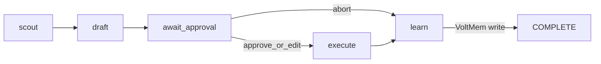

# Relay OS — HITL runtime + CommunityEngager + VoltMem

Canonical plan for the **runtime dogfood** (protocol → CommunityEngager → Telegram → VoltMem → Reddit). Open while the `relay-os` workspace is active.

**Product shell (living todo queue + in-card HITL):** see separate plan [`relay_living_todo_shell.plan.md`](./relay_living_todo_shell.plan.md).

## Product framing

**Layman differentiation (canonical copy):** root [`README.md`](../../README.md).

> n8n: wire systems; optionally ask a human before this node.  
> Loops: run an agent in a disciplined cycle until gates pass.  
> Relay: run an agent that negotiates with a human through a protocol, then acts.

| Piece | Role | Remains separate? |
|-------|------|-------------------|
| **Relay runtime** | Protocol, runtime, feedback broker, engines | This product (infra) |
| **VoltMem** | Current-truth memory (`@voltmem/client` + sidecar) | Yes — `~/Projects/voltmem` |
| **CommunityEngager** | First agentic app (Reddit scout → draft → approve → post) | First-party app; thin deploy may stay in `stylens-ops` |
| **gostylens-harness** | Voice, ICP, experiment design | Yes — strategy only |
| **Living todo shell** | Priority agent job queue + in-card feedback | Separate plan |

**Hard rule (community):** nothing posts without human Approve (Edit allowed; Abort is first-class).

**Non-goals (this plan):** living todo UI, fake desktop OS, free-form plan→manifest, Newsletter Migrator rewrite, agent marketplace. Those belong to the shell plan or later work.

## Why this path

- Dogfood Relay where HITL is mandatory (brand + ToS risk).
- Prove Feedback Broker + stages before / alongside the living-todo shell.
- VoltMem fills Context Engine as a real dependency.
- CommunityEngager becomes the first **job type** the living-todo plan plugs into.

## Current state (baseline)

Already in `relay-os` (Phases 0–2 landed; Phase 3 **deploy** done):

- Monorepo: protocol, runtime, feedback-broker, adapters-telegram, action-store, context-engine, llm-controller, engines-browser
- `apps/community-engager` dogfood path
- Skeleton `apps/newsletter-migrator` (parked)
- **ThinkPad dogfood LIVE** — see [`relay_thinkpad_deploy.plan.md`](./relay_thinkpad_deploy.plan.md): `/opt/voltmem` + `/opt/relay-community`, Telegram HITL, systemd/timer, `deploy/` runbook

Still open here: **measure** (Phase 3 remainder), product/ownership polish (Phase 4).

Siblings: `stylens-ops`, `voltmem`, `gostylens-harness`. Host also runs Beszel (monitoring; outside this plan).

## Target architecture


Living-todo queue and in-card UI attach to `FB` / `APP` in the [shell plan](./relay_living_todo_shell.plan.md).

### CommunityEngager stage map

Compact stage list (see the full scout → HITL → execute diagram in [`apps/community-engager/README.md`](../../apps/community-engager/README.md)):



| Stage | Engine | Feedback |
|-------|--------|----------|
| `scout` | `api` or `llm` (+ later browser) | `progress` (optional) |
| `draft` | `llm` | — |
| `await_approval` | — (broker only) | `approval` + `freeform` edit; intensity-2 → extra `confirmation` |
| `execute` | `api` (Reddit submit) | `error` on failure |
| `learn` | `data` / context | write outcomes to VoltMem |

## Implementation phases

### Phase 0 — Protocol & runtime — done

Abort/edit/optional feedback; feedback broker + CLI; action store.

### Phase 1 — Telegram + CommunityEngager — done

Telegram adapter + community app + fixture scout/draft E2E.

### Phase 2 — VoltMem + Reddit — done

Context engine + memory write/read + Reddit read + gated executor.

### Phase 3 — Deploy & measure

**Deploy — done (2026-10-01):** [`relay_thinkpad_deploy.plan.md`](./relay_thinkpad_deploy.plan.md)

1. ~~Namespaced ThinkPad root + VoltMem sidecar + Telegram HITL via systemd (one service among many)~~
2. ~~Land `deploy/` runbook/units in this repo; stylens-ops deploy notes are historical only~~
3. PostHog UTMs on intensity-2; harness taxonomy events (`p3-measure`) — **next**
4. Close Notion experiment with evidence

**Deploy exit criteria:** met (scheduled/timer runs on ThinkPad; Telegram HITL without laptop babysitting session). Cloudflare webhook remains a later escape hatch if needed.

### Phase 4 — Product slice (docs / ownership)

1. README points at both this plan and the living-todo shell plan
2. Document adapter + app SDK surfaces
3. Optional second adapter or thin second app stub
4. Decide `stylens-ops` → deploy-only vs archive
5. Monetization deferred

**Exit criteria:** New agentic app + Telegram HITL without reading stylens-ops.

### Phase 4a — Manifest-driven engines (declarative > imperative)

**Status:** shipped — `bindEngines()` in `@relay/runtime`; CommunityEngager uses `createCommunityEngines()` (Playwright + llm draft + data/VoltMem; api optional); stubs removed; AgentRuntime asserts engines on construct.

**Thesis:** The manifest should be the source of truth for *what* runs (stages, engines, feedback). Host `index.ts` should not hand-roll a stub `engines` map that ignores real work. Controller keeps *policy* (score gate, Approve, dry-run, memory writes) — not reinventing transport.

**Why now:** CommunityEngager already does scout/execute via Playwright + Reddit helpers while the manifest still says `engine: "api"` and `index.ts` injects stubs that the controller ignores (`_engine`). That drift fights the Relay story (“agent negotiates through a protocol”).

**Do (in scope)**

| Change | Detail |
|--------|--------|
| Manifest truth | Align `stage.engine` + `engines_required` with reality (`browser` for scout/execute once primary; `llm` draft; `data` learn; `none` HITL; add `ensure_session` + `credential` per reddit browser Phase 4b) |
| Runtime bind | Validate provided engines ⊇ `engines_required`; optional **engine registry/factory** so apps pass factories once, runtime fills from manifest |
| Thin host | `CommunityEngagerApp` stops constructing stub api/llm/data unless a stage truly has no backend |
| Controller role | `onStageStart` orchestrates domain logic *using* the resolved engine when useful; no parallel “secret” I/O path that contradicts `stage.engine` |

**Don’t (out of scope / anti-pattern)**

- Encoding score thresholds, allowlists, or draft prompts as opaque manifest JSON — those stay typed modules
- Making the manifest a full workflow DSL (n8n clone) — stages + engines + feedback_points is enough
- Blocking ThinkPad smoke / dry-run dogfood on a perfect registry — ship 4b + smoke first if needed; 4a can land in parallel

**Suggested shape (sketch)**

```ts
// Host supplies implementations (or factories), not one-off stubs
const engines = bindEngines(CommunityEngagerManifest, {
  browser: () => new PlaywrightEngine(/* … */),
  llm: () => createLlmEngine(/* … */),  // or keep draft in controller until LLM engine exists
  data: () => createDataEngine(memory),
  api: () => createRedditApiEngine(/* optional OAuth */),
});

new AgentRuntime(manifest, engines, ctx, controller);
```

Runtime: on start, assert every `engines_required` key exists; `resolveEngine` unchanged.

**Order relative to reddit browser plan:** implement alongside or right after **Phase 4b `ensure_session`** (credential HITL is itself manifest-declared). Prefer fixing `stage.engine` labels when adding `ensure_session` so we don’t add another stub.

**Exit criteria:** No unused stub engines for required stages; `manifest.stages[].engine` matches the code path that actually runs; second app can copy the pattern without reading CommunityEngager internals.

### Phase 5 — Per-opportunity jobs + fault isolation ✅ shipped

**Shipped shape:** manifest split into `CommunityEngagerManifest` (run: `ensure_session` → `scout`) and `CommunityJobManifest` (job: `draft` → `await_approval` → `execute` → `learn`). `CommunityEngagerApp.run()` starts the run runtime, then `runCommunityJobs` (`src/job-queue.ts`) creates one `AgentRuntime` + one controller per actionable opportunity, serially, each with its own broker attach/detach. `CommunityEngagerController` takes an `opportunity` option so a job controller drafts exactly its own thread (the `opportunities.find(isActionable)` path survives only as the single-runtime fallback).

Isolation comes from the runtime already containing stage errors as `FAILED` and aborts as `ABORTED`; the queue records the outcome and moves on. Jobs outside the stage loop (factory/broker faults) are caught by the queue itself. `RunSummary` / `formatRunSummary` report per-job outcomes plus `runState`, `scouted`, `skipped`. Budget: `COMMUNITY_MAX_JOBS` (default 3), `COMMUNITY_JOB_DELAY_MS` (default 1500).

E2E (`src/e2e-hitl.ts`, pinned to `SCOUT_SOURCE=fixtures`) now proves isolation directly: scenario 4 aborts job 1 while job 2 still posts; scenario 5 injects a store fault into job 1 and job 2 still posts.

**Problem (observed 2026-10-03):** a run produces **at most one draft**. `runDraft` takes `opportunities.find(isActionable)` and discards the rest, so four of five scouted threads are thrown away. Worse, any stage throw (`runExecute` on a failed post, draft with no actionable opportunity) puts the whole agent in `FAILED`, and an abort unwinds the entire run.

**Thesis:** one opportunity = one job, with its own id, status, and failure boundary. A bad thread must not take down the run; a human abort must scope to that draft only.

**Do**

| Change | Detail |
|--------|--------|
| Job identity | Each actionable opportunity gets a job id + action-store record; reuse the existing idempotent file under `{dataDir}/jobs/` but keyed per opportunity, not per run |
| Error boundary | A job that throws is marked `failed` with its error; the queue continues to the next job |
| Scoped abort | Abort kills that job only; remaining jobs still get their own HITL turn |
| Run summary | End of run reports per-job outcomes (`approved` / `edited` / `aborted` / `failed` / `skipped`) instead of a single agent state |
| Serial execution | Process jobs one at a time with the existing scout delay — rate limiting and anti-bot risk both argue against concurrency; one browser context is easier to reason about |

**Shape:** prefer **one `AgentRuntime` per opportunity** with a thin outer queue owning the list. That keeps the runtime's linear stage model honest and matches what the living-todo shell wants to render (a queue of jobs, each with its own HITL card). Looping inside the controller with `try/catch` is less work but muddles "one agent, many jobs".

**Don't**

- Parallel posting (ban risk, and the cookie jar is shared state)
- Swallowing errors silently — a failed job must be visible in the store and the run summary
- Re-scouting per job; scout once, queue the results

**Exit criteria:** a run with 5 actionable opportunities produces 5 jobs; one failing or aborted job leaves the others unaffected; retry of the run is idempotent per job.

### Phase 6 — Subreddit discovery + memory-backed allowlist

**Thesis:** stop hardcoding `ALLOWLISTED_SUBREDDITS`. Let the agent research candidate subs, but keep the human as the gate for anything we might *post* into.

**Boundary that matters:** discovery is **read-only and proposal-based**. The allowlist stays a *write* gate — posting into an unvetted sub is how the account gets banned, since rules differ wildly and some ban self-promo outright.

```text
discover (read-only) → score candidates → HITL approve → promote into memory-backed allowlist
```

**Do**

| Change | Detail |
|--------|--------|
| Discovery lane | Read-only pass that proposes candidate subs (topic fit, activity, question density, rules text) |
| HITL promotion | Candidates surface as a `choice` / `approval` feedback point; only approved subs become postable |
| Memory as source of truth | Store ranked subs in VoltMem with evidence + rules notes (`CommunityMemory.subredditRules` already exists); scout reads the learned list instead of the hardcoded array |
| Outcome feedback | Approve/abort history per sub feeds the ranking, so bad subs decay without manual pruning |
| Periodic exploration | Mostly exploit known-good subs; occasionally spend one run slot on a candidate — gives "research new opportunities" without a separate schedule |

**Don't**

- Auto-promote a discovered sub to postable
- Let discovery widen scope during a normal run (it is its own lane, budgeted separately)
- Drop the hardcoded list before memory can serve a usable allowlist — keep it as the seed/fallback

**Exit criteria:** scout reads subs from memory with the static list as fallback; a newly discovered sub requires explicit human approval before any draft targets it; per-sub outcomes visibly influence later ranking.

### Phase 7 — Nested manifests (`StageDefinition.fanout`) ✅ shipped

**Shipped:** `FanoutDefinition` on `StageDefinition` in `@relay/protocol`. `@relay/runtime` expands a fanout stage into N serial child `AgentRuntime`s via `FanoutHost` (create controller, broker attach/detach, max/delay overrides). Results land in `stageResults[stage]` + `ctx.fanoutSummary`. Recursive fanout rejected in v1. `bindEngines` / `assertEnginesForManifest` walk nested manifests.

CommunityEngager: one parent `CommunityEngagerManifest` nests `CommunityJobManifest` on the `jobs` stage; `CommunityEngagerApp` is a thin `FanoutHost` and `run()` is just `runtime.start()`. App-local `job-queue.ts` is now summary formatting only.

**Thesis:** Phase 5 proved the pattern in CommunityEngager (`job-queue.ts`). A second app (newsletter batch, living-todo cards, …) will need the same “scout once → N isolated HITL jobs”. Lift that into the protocol so nesting is declarative.

**Shape (product sense nested, engine sense siblings):**

```text
ParentManifest
  stage A → stage B → stage jobs { fanout: { manifest: ChildManifest, from: "items" } }
                              ↓
                    child AgentRuntime × N (flat ChildManifest each)
```

Each child is its own `AgentRuntime` with a flat stage list. No recursive fanout in v1. Serial only.

**Do**

| Change | Detail |
|--------|--------|
| Protocol | `FanoutDefinition` on `StageDefinition.fanout` (`manifest`, `from`, `itemKey?`, `max?`, `mode: "serial"`, `delay_ms?`) |
| Runtime | On a fanout stage: read `ctx[from]`, spawn children, contain errors, write `FanoutSummary` to `stageResults` |
| Host hooks | `FanoutHost` — create child controller, attach/detach broker, optional max/delay overrides |
| CommunityEngager | One parent manifest nests `CommunityJobManifest`; `app.run()` is just `runtime.start()` |
| Engines | `assertEnginesForManifest` walks nested fanout manifests |

**Don't**

- Parallel fanout (shared cookie jar / rate limits)
- Recursive nesting
- Merging parent+child into one linear stage list (loses isolation)

**Exit criteria:** CommunityEngager has a single parent manifest with an inline nested job manifest; E2E isolation scenarios still pass; a second app can copy fanout without importing `job-queue.ts`.

## Suggested package / app layout

```text
relay-os/
├── apps/
│   ├── community-engager/     ← this plan
│   ├── living-todo/           ← shell plan
│   └── newsletter-migrator/   ← parked
├── packages/
│   ├── protocol/
│   ├── runtime/
│   ├── feedback-broker/
│   ├── adapters-telegram/
│   ├── context-engine/
│   ├── action-store/
│   ├── llm-controller/
│   └── engines-browser/
└── .cursor/plans/
    ├── relay_hitl_community_voltmem.plan.md  ← this file
    ├── relay_thinkpad_deploy.plan.md         ← ThinkPad dogfood (LIVE)
    └── relay_living_todo_shell.plan.md
```

## Implementation order (this plan)

1. ~~Protocol + runtime~~
2. ~~Broker + CLI + action store~~
3. ~~CommunityEngager + Telegram~~
4. ~~VoltMem + Reddit~~
5. ~~Deploy (ThinkPad)~~ → **measure** (open)
6. ~~Manifest-driven engines (Phase 4a)~~ + ~~reddit browser 4b ensure_session~~
7. ~~Per-opportunity jobs + fault isolation (Phase 5)~~
8. ~~Nested manifests / fanout (Phase 7)~~
9. ~~Interstitial detect + escalate (reddit browser Phase 4c)~~
10. ~~ThinkPad deploy slice + smoke docs~~ (`deploy/`)
11. **Subreddit discovery + memory allowlist (Phase 6)** ← next
12. Product slice / ownership / measure

Then continue in [`relay_living_todo_shell.plan.md`](./relay_living_todo_shell.plan.md).

## Risks & mitigations

| Risk | Mitigation |
|------|------------|
| Three repos stall progress | Freeze newsletter migrator; one community vertical here |
| Reddit API / policy blocks write | HITL + fixtures + dry-run first; write last; browser/JSON transport → [`relay_reddit_browser.plan.md`](./relay_reddit_browser.plan.md) |
| VoltMem profile mismatch | Fail-open; free-text facts; tune domains later |
| Duplicate bots in stylens-ops + Relay | Single Telegram adapter in Relay |
| Mixing shell scope into this plan | Living todo tracked only in shell plan |
| One bad thread kills the run | Per-opportunity jobs + nested fanout (Phases 5–7) |
| Agent posts into an unvetted sub | Discovery proposes; allowlist stays a human-gated write boundary (Phase 6) |

## Success criteria (this plan)

- [x] Abort is first-class and prevents execute
- [x] Edit updates draft before post
- [x] Telegram is only a Feedback Broker adapter
- [x] VoltMem influences at least one subsequent draft
- [x] Approved posts only via executor after `approved`/`edited`
- [x] Deploy path documented / running (ThinkPad — [`relay_thinkpad_deploy.plan.md`](./relay_thinkpad_deploy.plan.md))
- [ ] Measure path closed with evidence (PostHog UTMs + Notion experiment)
- [ ] stylens-ops ownership decided

## Related

- Reddit browser / scrape transport (no API app): [`relay_reddit_browser.plan.md`](./relay_reddit_browser.plan.md) — **4b ensure_session** + **4a engines** done; next: deploy/smoke
- ThinkPad deploy: [`relay_thinkpad_deploy.plan.md`](./relay_thinkpad_deploy.plan.md)
- Living todo shell: [`relay_living_todo_shell.plan.md`](./relay_living_todo_shell.plan.md)
- README: [`README.md`](../../README.md)
- Architecture: [`ARCHITECTURE.md`](../../ARCHITECTURE.md)
- stylens-ops plan: `~/Projects/stylens-ops/.cursor/plans/stylens_ops_community_hitl.plan.md`
- VoltMem sidecar: `~/Projects/voltmem/docs/SIDECAR.md`
- Notion experiment: Community HITL — Reddit fashion/styling → installs
