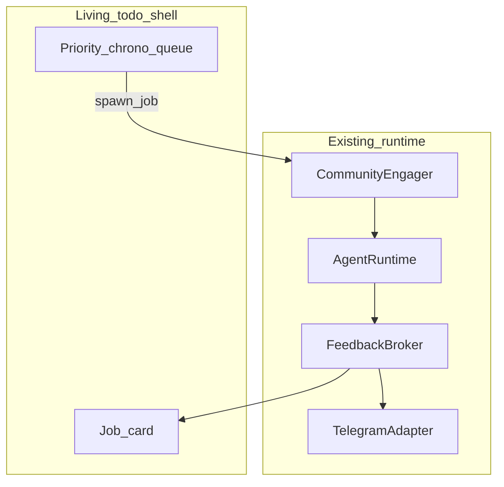

# Relay — living todo shell

Canonical plan for the **product UX / OS shell**. Open while the `relay-os` workspace is active.

Community HITL runtime dogfood lives in a **separate** plan: [`relay_hitl_community_voltmem.plan.md`](./relay_hitl_community_voltmem.plan.md). This plan **consumes** that stack; it does not re-implement scout/Reddit/VoltMem.

## Product framing

**Layman copy (also in README):**

> **Living todo:** a priority queue of agent jobs; each job plans a manifest, runs stages, and pauses the card when a human must decide.

### Full vertical

```text
┌─────────────────────────────────────────┐
│  Living todo UX                         │  ← this plan
│  Add job + priority → queue executes    │
├─────────────────────────────────────────┤
│  Feedback surface (gotoHuman-style)     │  ← this plan (in-card)
│  approve, edit, choice, credential, abort│     Telegram = existing adapter
├─────────────────────────────────────────┤
│  Relay protocol + runtime               │  ← community / VoltMem plan
│  + VoltMem + engines + agentic apps     │
└─────────────────────────────────────────┘
```

Not another AI Todoist. Not approve/deny-only (gotoHuman alone). Queue + review UI + runtime = Relay.

**Competitors (awareness):** AgentRQ / TaskPeace / Axel (coding-agent queues); gotoHuman / VekInbox (approval inboxes). Wedge: typed feedback protocol + multi-engine agentic apps + living queue as the shell.

## Depends on

From [`relay_hitl_community_voltmem.plan.md`](./relay_hitl_community_voltmem.plan.md) (mostly done):

- `@relay/protocol` + `AgentRuntime` (`WAITING_USER`, abort/edit)
- `feedback-broker` + CLI / Telegram adapters
- `action-store`
- `apps/community-engager` as first **job type**
- `context-engine` / VoltMem (optional for shell v1; required for smart drafts)

## Target architecture



### Job model (v1)

| Field | Notes |
|-------|--------|
| `id` | Stable id |
| `title` | Human label |
| `kind` | `agentic` only in v1 |
| `priority` | Ordered tag / number |
| `createdAt` | Chrono tie-break |
| `status` | `queued` \| `running` \| `waiting_you` \| `done` \| `failed` \| `aborted` |
| `appId` / manifest ref | e.g. CommunityEngager |
| `plan` | Optional blob; template path first |

**Scheduler:** higher priority first; same priority → older first. Prefer: jobs may run while another is `waiting_you`.

## Implementation

### 1. Job model + persistence

- `packages/job-queue` **or** extend `action-store` with a Job record type
- Map status ↔ agent lifecycle (`WAITING_USER` → `waiting_you`, abort → `aborted`, etc.)

### 2. Living todo shell UI

- App: `apps/living-todo` (web or local UI — choose light stack when implementing)
- Add job + priority
- List ordered by scheduler
- Card shows live state from runtime events

### 3. In-card feedback (gotoHuman-style)

- When status is `waiting_you`, card presents FeedbackRequest context (draft, intensity, etc.)
- Approve / Edit / Abort → `FeedbackResponse` via Feedback Broker
- Telegram remains a **parallel** adapter, same contract

### 4. Community as first job type

- “Scout / engage community” template → spawn existing CommunityEngager
- **Defer:** free-form NL → arbitrary manifest; manual grocery todos

### 5. E2E

Create job → run → wait on card → edit/approve → execute or abort; two jobs prove priority order.

## Non-goals (this plan)

- Fake desktop / command-bar PWA
- Free-form plan → any manifest
- Replacing Telegram (keep as adapter)
- Reworking Reddit/VoltMem (other plan)
- Coding-agent fleet orchestration (Axel/TaskPeace territory)

## Layout (end state)

```text
relay-os/
├── apps/
│   ├── living-todo/           ← this plan
│   └── community-engager/     ← other plan (job type)
├── packages/
│   ├── job-queue/             ← optional new
│   ├── feedback-broker/       ← existing
│   └── …
└── .cursor/plans/
    ├── relay_living_todo_shell.plan.md      ← this file
    └── relay_hitl_community_voltmem.plan.md ← runtime dogfood
```

## Success criteria

- [ ] Create community job from UI with priority
- [ ] Queue ordering (priority then chrono) visible
- [ ] Card enters `waiting_you` and supports Approve / Edit / Abort
- [ ] Approved path reaches execute; abort never posts
- [ ] Telegram still works as optional adapter for the same feedback

## Related

- README product stack: [`README.md`](../../README.md)
- Community + VoltMem plan: [`relay_hitl_community_voltmem.plan.md`](./relay_hitl_community_voltmem.plan.md)
- Architecture: [`ARCHITECTURE.md`](../../ARCHITECTURE.md)
