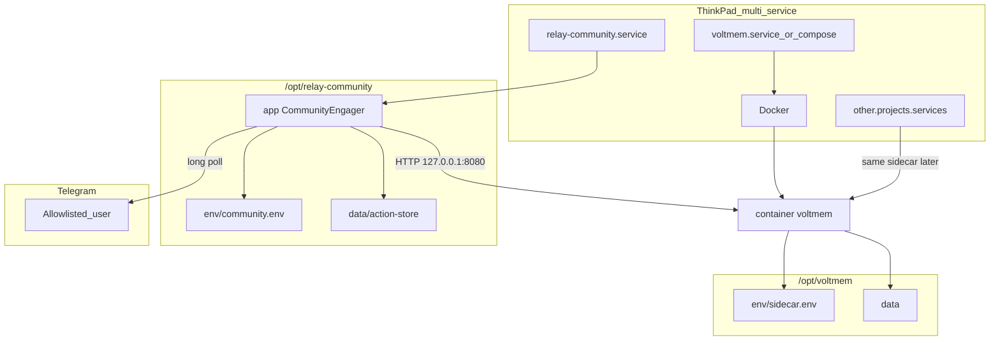

# Relay — ThinkPad community deploy

Canonical plan for **dogfood deployment** of CommunityEngager HITL on a Linux ThinkPad (or any always-on box).

**Status (2026-10-01): LIVE on host.** Layout, VoltMem sibling, env, Telegram smoke, and systemd/timer are in place. This doc remains the runbook + reference; active product work continues on HITL `p3-measure` and the living-todo shell.

**Runtime / product plans stay separate:**

- HITL stack: `[relay_hitl_community_voltmem.plan.md](./relay_hitl_community_voltmem.plan.md)` (owns protocol → app → VoltMem client → measure)
- Living todo shell: `[relay_living_todo_shell.plan.md](./relay_living_todo_shell.plan.md)`

This plan covers: Relay community host layout, **VoltMem as a sibling program**, env, systemd as one service among many, smoke runbook.

## Goals

1. Overnight (or scheduled) scout → Telegram draft HITL without a login session.
2. Confine **Relay community** artifacts under `/opt/relay-community/`.
3. Run **VoltMem as its own program** under `/opt/voltmem/` so other projects can share the same sidecar later.
4. Leave the ThinkPad free for other programs — dedicated units, ports, data dirs.
5. Land reusable `deploy/` in `relay-os` for the Relay side; VoltMem deploy assets live with VoltMem.

## Non-goals

- Embedding VoltMem inside the Relay tree (data or ownership).
- Cloudflare Telegram webhook (later escape hatch; note only).
- Postgres action-store / multi-tenant SaaS.
- Living-todo UI on the ThinkPad.
- Taking over the host (no shared `.bashrc` secrets).

## Principles


| Principle                   | Meaning                                                                                     |
| --------------------------- | ------------------------------------------------------------------------------------------- |
| **Two namespaces**          | `/opt/voltmem` = shared memory infra; `/opt/relay-community` = this dogfood app             |
| **VoltMem is a program**    | Own container name, volume, env, restart policy; Relay only sets `VOLTMEM_URL` + client key |
| **One unit = one job**      | `relay-community.service` does not own VoltMem, Docker daemon, or other apps                |
| **Localhost only**          | Sidecar on `127.0.0.1:8080` (or remapped); not public                                       |
| **Dry-run first**           | `REDDIT_DRY_RUN=true` until smoke + HITL proven                                             |
| **Host power ≠ app config** | No-sleep is a **server** policy for any long-poll/listener                                  |


## Target layout on the machine

```text
/opt/voltmem/                         # SHARED — any project may use this
├── env/
│   └── sidecar.env                   # VOLTMEM_API_KEY; chmod 600
├── data/                             # Docker bind mount → container /data
├── deploy/
│   ├── docker-compose.yml            # or run script + systemd unit
│   └── voltmem.service               # optional: docker compose up -d
└── logs/                             # optional

/opt/relay-community/                 # THIS APP ONLY
├── app/                              # relay-os (full or sparse)
│   ├── apps/community-engager/
│   └── packages/{protocol,runtime,...}
├── env/
│   └── community.env                 # Telegram, Reddit, VOLTMEM_URL/KEY (client)
├── data/
│   └── action-store/                 # FileJson — Relay state only
├── deploy/                           # copies of relay units (or symlink to repo)
└── logs/
```

- Container name: `**voltmem**` (not `relay-community-voltmem`).
- Later apps (living todo, other repos) point at the same `http://127.0.0.1:8080` with their own `user_id` / API key policy as VoltMem docs allow.

## Workspace slice (under `relay-community/app/`)

CommunityEngager needs:

- `apps/community-engager`
- `packages/protocol`, `runtime`, `action-store`, `feedback-broker`, `adapters-telegram`, `context-engine`
- npm `@voltmem/client` (HTTP client only — does **not** embed the Python engine)

**Not required:** `newsletter-migrator`, `engines-browser`, living-todo UI, most docs.

**v1:** full `relay-os` clone under `app/` is fine.

## Architecture (host)




## Step-by-step

### Step 0 — Decide layout

- [ ] VoltMem root: `/opt/voltmem` (system) — **required for multi-project reuse**
- [ ] Relay root: `/opt/relay-community` (system) **or** `~/relay-community` (user)
- [ ] systemd: **system** units preferred (no linger); user units only if home-dir-only

### Step 1 — Create both trees

```bash
sudo mkdir -p /opt/voltmem/{env,data,deploy,logs}
sudo mkdir -p /opt/relay-community/{app,env,data/action-store,deploy,logs}
sudo chown -R "$USER:$USER" /opt/voltmem /opt/relay-community
```

### Step 2 — Sync Relay code

```bash
git clone <relay-os-url> /opt/relay-community/app
cd /opt/relay-community/app
pnpm install
pnpm --filter @relay/apps-community-engager... build
```

### Step 3 — Install VoltMem as its own program

Per `~/Projects/voltmem/docs/SIDECAR.md` (build image if GHCR pull unavailable).

Prefer compose under `/opt/voltmem/deploy/`:

```yaml
# /opt/voltmem/deploy/docker-compose.yml
services:
  voltmem:
    image: ghcr.io/rouche01/voltmem-sidecar:latest
    container_name: voltmem
    restart: unless-stopped
    ports:
      - "127.0.0.1:8080:8080"
    env_file:
      - /opt/voltmem/env/sidecar.env
    volumes:
      - /opt/voltmem/data:/data
```

```bash
# /opt/voltmem/env/sidecar.env
VOLTMEM_API_KEY=…   # chmod 600

cd /opt/voltmem/deploy && docker compose up -d
curl -s http://127.0.0.1:8080/health
```

Optional: `voltmem.service` that only runs `docker compose up -d` / `docker start voltmem`. **Do not** put this unit under Relay’s deploy ownership long-term — copy from voltmem repo or keep only on the host under `/opt/voltmem/deploy/`.

### Step 4 — Relay env (client of VoltMem)

```bash
cp /opt/relay-community/app/apps/community-engager/.env.example \
   /opt/relay-community/env/community.env
chmod 600 /opt/relay-community/env/community.env
```

Set at least:

- `FEEDBACK_ADAPTER=telegram` + Telegram bot / allowlist
- `VOLTMEM_URL=http://127.0.0.1:8080`
- `VOLTMEM_API_KEY=` same key as sidecar (or a dedicated client key if you split later)
- `VOLTMEM_USER_ID=` stable id for this app’s memories (e.g. `relay-community`)
- Reddit + `REDDIT_DRY_RUN=true`

Other future projects use different `VOLTMEM_USER_ID` (and the same URL) so memories stay partitioned.

### Step 5 — Manual smoke (before systemd)

```bash
cd /opt/relay-community/app/apps/community-engager
set -a && source /opt/relay-community/env/community.env && set +a
node dist/run-dev.js
```

Exit criteria: Telegram draft HITL works; VoltMem health ok (or fail-open noted); wiping `/opt/relay-community` would **not** delete `/opt/voltmem/data`.

### Step 6 — systemd units (on the ThinkPad)

`run-dev.js` is a **one-shot** job (scout → Telegram → exit), not a forever daemon. You install a **service** (how to run it) and optionally a **timer** (when to run it).

Templates live in the repo after pull/sync: `[deploy/](../../deploy/)`. Follow `[deploy/README.md](../../deploy/README.md)` or this condensed path:

#### 6.1 Prereq

Manual smoke (Step 5) already works. VoltMem is up (`curl http://127.0.0.1:8080/health`).

#### 6.2 Sync latest `deploy/` onto the box

If the clone is older than this change:

```bash
cd /opt/relay-community/app && git pull
```

#### 6.3 Resolve Node path (required)

systemd does **not** see nvm. On the ThinkPad:

```bash
which node
whoami
```

#### 6.4 Create real unit files from examples

```bash
cd /opt/relay-community/app/deploy
cp relay-community.service.example relay-community.service
cp relay-community.timer.example relay-community.timer   # optional schedule
```

Edit `relay-community.service`:

1. Replace `User=` / `Group=` with `whoami` (owner of `/opt/relay-community`).
2. Replace `ExecStart=` first token with the **absolute** path from `which node`.
3. Leave `WorkingDirectory` and `EnvironmentFile` as `/opt/relay-community/...` unless you used different roots.

Example after edit:

```ini
User=richard
Group=richard
ExecStart=/home/richard/.nvm/versions/node/v22.14.0/bin/node /opt/relay-community/app/apps/community-engager/dist/run-dev.js
```

#### 6.5 Install into systemd

```bash
sudo cp /opt/relay-community/app/deploy/relay-community.service /etc/systemd/system/
sudo cp /opt/relay-community/app/deploy/relay-community.timer /etc/systemd/system/   # if using timer
sudo systemctl daemon-reload
```

#### 6.6 Test once (no timer yet)

```bash
sudo systemctl start relay-community.service
sudo systemctl status relay-community.service
journalctl -u relay-community.service -n 80 --no-pager
```

Expect Telegram HITL like the manual run. Fix env / Node path if it fails.

#### 6.7 Optional — schedule mornings

Default timer: every day **07:00** local time (`OnCalendar` in the `.timer` file — edit if you want).

```bash
sudo systemctl enable --now relay-community.timer
systemctl list-timers | grep relay
```

You usually **do not** `enable` the `.service` for boot when the timer owns the schedule; `start` for manual runs is enough.

#### 6.8 VoltMem unit

Still optional and **not** in `relay-os/deploy/`. Compose under `/opt/voltmem/deploy/` with `restart: unless-stopped` is enough. A `voltmem.service` would live only under `/opt/voltmem/deploy/`.

### Step 7 — Verify (merged with 6.6–6.7)

If Step 6 succeeded, you already enabled units. Quick health:

```bash
docker ps --filter name=voltmem
curl -s http://127.0.0.1:8080/health
systemctl is-active relay-community.timer    # if enabled
journalctl -u relay-community.service -f     # while testing a start
```

### Step 8 — Host power (shared server policy)

Document in `relay-os/deploy/README.md`:

- Disable suspend / lid-close sleep for the **machine** if long-poll must stay up.
- Benefits VoltMem, Relay, and any other always-on service.
- Later: Cloudflare webhook reduces need for 24/7 Telegram poll on this box.

### Step 9 — Scheduled / overnight

`run-dev.js` is one-shot today. Prefer a **systemd timer** for dogfood mornings; long-lived poller or CF webhook later.

### Step 10 — Hand off to measure

- Mark HITL `p3-deploy-ops` complete (link here).
- Continue `p3-measure` on the HITL plan.
- stylens-ops deploy README = historical stub only.

## Multi-program coexistence checklist

- [x] `/opt/voltmem` independent of `/opt/relay-community`
- [x] Other projects may add `/opt/other-app` and call the same VoltMem URL
- [x] Separate systemd units / compose projects; no shared `EnvironmentFile`
- [x] Port `127.0.0.1:8080` reserved for VoltMem (or document remap)
- [x] Container name `voltmem` — not app-prefixed
- [x] Deleting or reinstalling Relay does not wipe VoltMem data
- [x] Relay failures do not restart VoltMem (and vice versa, unless you explicitly Want=)

## Risks


| Risk                                   | Mitigation                                                                              |
| -------------------------------------- | --------------------------------------------------------------------------------------- |
| Treating VoltMem as “Relay’s database” | Separate roots + container name; document reuse                                         |
| API key sprawl                         | One sidecar key in `/opt/voltmem/env`; clients copy into their env; rotate in one place |
| Monorepo heavy on disk                 | Sparse checkout or later deploy image                                                   |
| One-shot `run-dev`                     | Timer or long-lived entrypoint                                                          |
| Lid/sleep                              | Host power policy or CF webhook                                                         |
| Duplicate Telegram bots                | Single bot owner (Relay adapter)                                                        |


## Success criteria

- [x] VoltMem runs under `/opt/voltmem` with its own restart/data lifecycle
- [x] Relay community runs under `/opt/relay-community` and only *consumes* VoltMem over localhost
- [x] Manual Telegram HITL smoke passes
- [x] systemd/timer starts Relay without a login shell
- [x] `deploy/` in `relay-os` documents the sibling VoltMem layout
- [x] A second project could be pointed at the same sidecar without moving volumes
- [x] HITL `p3-deploy-ops` completable via this plan

**Host companions (not part of this plan’s todos):** Beszel under `/opt/beszel` for machine monitoring; Shoutrrr → separate Telegram alerts bot.

## Related

- HITL / measure: `[relay_hitl_community_voltmem.plan.md](./relay_hitl_community_voltmem.plan.md)`
- VoltMem product + sidecar docs: `~/Projects/voltmem/docs/SIDECAR.md`
- stylens-ops stub: `~/Projects/stylens-ops/deploy/README.md`
- App env template: `[apps/community-engager/.env.example](../../apps/community-engager/.env.example)`

