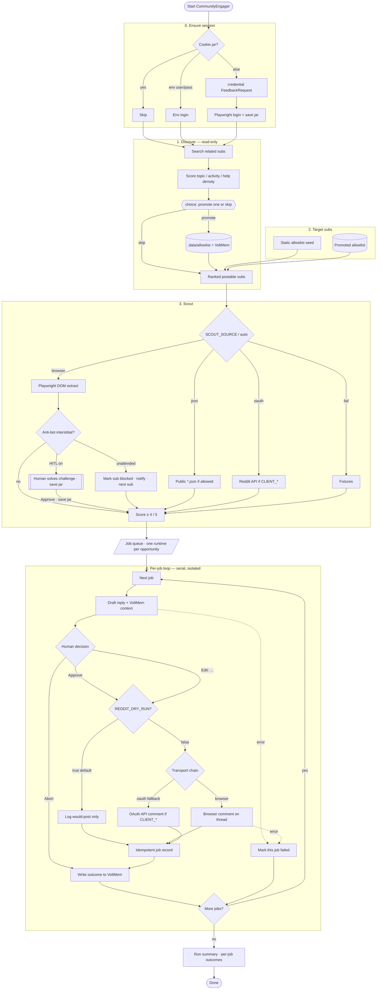

# CommunityEngager

First Relay dogfood app: discover fashion/styling subreddits (HITL promote onto allowlist), scout postable subs, draft a reply, **pause for human Approve / Edit / Abort**, then optionally post, then write outcomes to VoltMem.

**Hard rule:** nothing posts without human Approve (`REDDIT_DRY_RUN=true` by default).  
**Allowlist rule:** discovery only proposes; a sub is not postable until a human promotes it.

Related plans:

- [HITL + CommunityEngager + VoltMem](../../.cursor/plans/relay_hitl_community_voltmem.plan.md) — Phase 6 discovery + nested fanout
- [Reddit browser / scrape transport](../../.cursor/plans/relay_reddit_browser.plan.md) — browser scout, ensure_session, interstitial HITL
- [ThinkPad deploy](../../.cursor/plans/relay_thinkpad_deploy.plan.md) · runbook [`deploy/README.md`](../../deploy/README.md) · [`deploy/SMOKE.md`](../../deploy/SMOKE.md)

## Workflow

Ensure session → **discover** (optional / env) → scout allowlist → queue one job per opportunity → draft → you decide → execute only if approved → memory learns.



### Stages (short)

| Stage | What happens |
|-------|----------------|
| `ensure_session` | Cookie jar / HITL login before live browser work (skipped when dry-run unless `REDDIT_ENSURE_SESSION=true`) |
| `discover` | Read-only subreddit research → `choice` HITL to promote onto allowlist (or skip) |
| `scout` | Find actionable threads on **postable** allowlist (browser → json → oauth → fixtures); anti-bot wall → headed browser + Telegram/CLI Approve (never auto-solved) |
| `draft` | Write a reply with Gemini when `GEMINI_API_KEY` is set; otherwise a stub. May pull VoltMem context |
| `await_approval` | You Approve / Edit / Abort (Telegram or CLI) |
| `execute` | Dry-run log, or live browser/oauth post |
| `learn` | Persist outcome to VoltMem (`community_outcome`) + allowlist ranking |

`ensure_session`, `discover`, and `scout` run once on the parent manifest. The `jobs` stage **fans out** into the nested `CommunityJobManifest` — one isolated `AgentRuntime` per opportunity. A job that fails or gets aborted is recorded and the queue moves on. Budget with `COMMUNITY_MAX_JOBS` (default 3) and `COMMUNITY_JOB_DELAY_MS` (default 1500). Discover defaults to `COMMUNITY_DISCOVER=auto` (skip when the postable allowlist is healthy); use `force` / `--force-discover` to research anyway, or `off` to never run.

### Rules that matter

| Rule | Meaning |
|------|--------|
| Nothing posts without Approve | Abort skips execute |
| `REDDIT_DRY_RUN=true` | Safe default — logs only |
| Browser first | Playwright + cookies; OAuth optional backup |
| Allowlist + score ≥4 | Only certain subs / strong fits |
| CAPTCHAs are never auto-solved | Detect, then escalate to a human or degrade quietly |
| Discovery proposes, humans promote | A newly researched sub is not postable until approved |

## Quick start

```bash
# From repo root (Node 22+)
pnpm --filter @relay/engines-browser exec playwright install chromium
cp apps/community-engager/.env.example apps/community-engager/.env
# Set Telegram (or FEEDBACK_ADAPTER=cli), REDDIT_USERNAME/PASSWORD for browser path

pnpm --filter @relay/apps-community-engager build
REDDIT_LOGIN_HEADED=true pnpm --filter @relay/apps-community-engager login:reddit   # once
pnpm --filter @relay/apps-community-engager start
```

See [`.env.example`](./.env.example) for `SCOUT_SOURCE`, `REDDIT_TRANSPORT`, cookie dir, and dry-run flags.

## Browse / edit local data

Loopback admin for **Actions**, **Allowlist**, **Jobs**, and **Runs** under `.data/`. Domain rules apply (action lifecycle; allowlist promote/reject). Jobs/runs are inspect (+ delete).

Set once in [`.env`](./.env) (see [`.env.example`](./.env.example)):

```bash
ACTION_STORE_PATH=.data/actions.json
# optional override for the whole data root:
# REDDIT_DATA_DIR=.data
```

Then:

```bash
pnpm --filter @relay/action-store build
pnpm --filter @relay/apps-community-engager admin:store
# → http://127.0.0.1:8787
```

Optional: `ACTION_STORE_ADMIN_PORT=8790`, or `ACTION_STORE_ENV_FILE=/path/to/.env`.

Action CLI (same store):

```bash
pnpm --filter @relay/apps-community-engager run actions list --status pending_approval
pnpm --filter @relay/apps-community-engager run actions get <id>
pnpm --filter @relay/apps-community-engager run actions edit <id> --field draftText --value 'Revised reply…'
```

Do not hand-edit JSON under `.data/` while the agent is writing.
