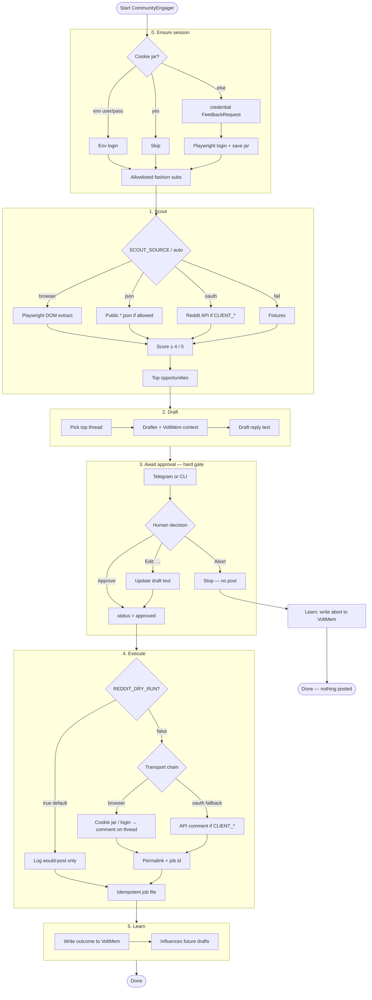

# CommunityEngager

First Relay dogfood app: scout allowlisted Reddit fashion/styling threads, draft a reply, **pause for human Approve / Edit / Abort**, then optionally post, then write outcomes to VoltMem.

**Hard rule:** nothing posts without human Approve (`REDDIT_DRY_RUN=true` by default).

Related plans:

- [HITL + CommunityEngager + VoltMem](../../.cursor/plans/relay_hitl_community_voltmem.plan.md)
- [Reddit browser / scrape transport](../../.cursor/plans/relay_reddit_browser.plan.md) — Phase 4b `ensure_session` (credential via Telegram/CLI)
- [ThinkPad deploy](../../.cursor/plans/relay_thinkpad_deploy.plan.md)

## Workflow

Ensure session (cookie jar, env, or HITL login), scout finds, draft proposes, you decide, execute only if approved, memory learns.



### Stages (short)

| Stage | What happens |
|-------|----------------|
| `ensure_session` | Cookie jar, env login, or HITL `credential` (skipped when dry-run unless `REDDIT_ENSURE_SESSION=true`) |
| `scout` | Find actionable threads (browser → json → oauth → fixtures) |
| `draft` | Write a reply; may pull VoltMem context |
| `await_approval` | You Approve / Edit / Abort (Telegram or CLI) |
| `execute` | Dry-run log, or live browser/oauth post |
| `learn` | Persist outcome to VoltMem |

### Rules that matter

| Rule | Meaning |
|------|--------|
| Nothing posts without Approve | Abort skips execute |
| `REDDIT_DRY_RUN=true` | Safe default — logs only |
| Browser first | Playwright + cookies; OAuth optional backup |
| Allowlist + score ≥4 | Only certain subs / strong fits |

## Quick start

```bash
# From repo root (Node 22+)
pnpm --filter @relay/engines-browser exec playwright install chromium
cp apps/community-engager/.env.example apps/community-engager/.env
# Set Telegram (or FEEDBACK_ADAPTER=cli), REDDIT_USERNAME/PASSWORD for browser path

pnpm --filter @relay/apps-community-engager build
REDDIT_LOGIN_HEADED=true pnpm --filter @relay/apps-community-engager login:reddit   # once
pnpm --filter @relay/apps-community-engager start
```

See [`.env.example`](./.env.example) for `SCOUT_SOURCE`, `REDDIT_TRANSPORT`, cookie dir, and dry-run flags.
